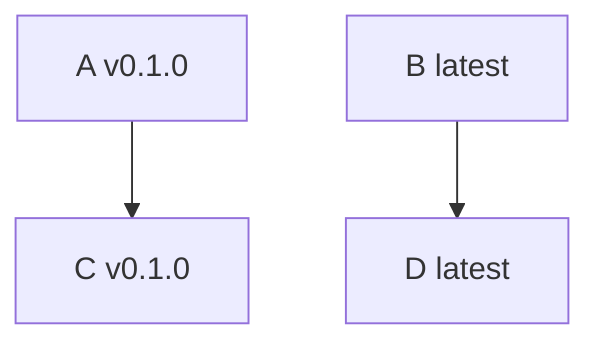
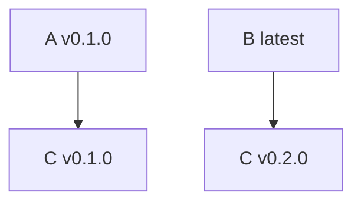

# deppy

Deppy: The dependency resolver for Kubernetes

## Introduction

Deppy is a Kubernetes API that runs on- or off-cluster for resolving constraints over catalogs of
[RukPak](https://github.com/operator-framework/rukpak) bundles.
Deppy is part of the next iteration of OLM and was first introduced
[here](https://hackmd.io/upiNuoeJTwqNKQJCVMZADw).
The initial goal of the project is to remove the dependency manager from the
[Operator Lifecycle Manager](https://github.com/operator-framework/operator-lifecycle-manager)
(OLM) and make it its own generic component.

### Concepts

Within the context of a package manager, there are a set of expectations from the
user that the package manager should never:

- install a package whose dependencies cannot be fulfilled or that conflict with
another package's dependencies
- install a package whose constraints cannot be met by the current set of installable packages
- update a package in a way that breaks another that depends on it

The job of a resolver, given a set of entities to install and the constraints for
each those entities, is to identify whether or not those entities are compatible.
In the case of Deppy, those entities can be things that are intended to be installed
(e.g. bundles) or default global constraints. The constraints for an entity define any
dependencies the entity has or any other requirement for the entity, for example
a version to pin the entity to.

#### Examples

##### Successful Resolution

The user would like to install packages A and B that have the following dependencies:

Additionally, the user would like to pin the version of A to v0.1.0.

**Entities and Constraints passed to Deppy**
Entities:

- A
- B

Constraints:

- A v0.1.0 depends on C v0.1.0
- A pinned to version v0.1.0
- B depends on D

**Deppy Output**
Resolution Set:

- A v0.1.0
- B latest
- C v0.1.0
- D latest

##### Unsuccessful Resolution

The user would like to install packages A and B that have the following dependencies:

Additionally, the user would like to pin the version of A to v0.1.0.

**Entities and Constraints passed to Deppy**
Entities:

- A
- B

Constraints:

- A v0.1.0 depends on C v0.1.0
- A pinned to version v0.1.0
- B latest depends on C v0.2.0

**Deppy Output**
Resolution Set:

- Unable to resolve because A v0.1.0 requires C v0.1.0, which conflicts with
B latest requiring C v0.2.0

## Contributing

The Deppy project is community driven and is part of the broader
Kubernetes ecosystem. New contributors are welcome and
highly encouraged. See the [contributing guidelines](CONTRIBUTING.md) to get started.

This project uses GitHub issues and milestones to prioritize and keep track of
ongoing work. To see the current state of the project, checkout the
[open issues](https://github.com/operator-framework/deppy/issues) and
[recent milestones](https://github.com/operator-framework/deppy/milestones).

## Getting Started

### Installation

*How to install this project*

### Quickstart

*How to quickly get started with this project*
